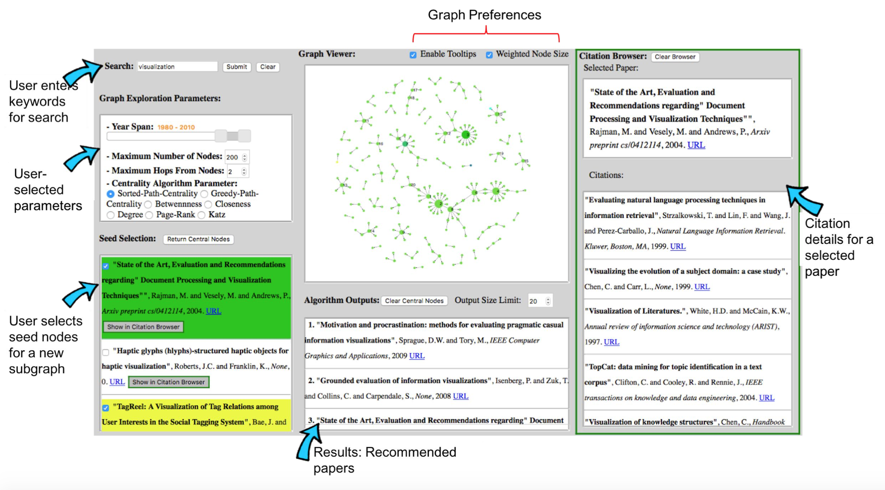

# Article-Recommendation
Scholarly Article Recommendation for Newbies (GATech Course Project: CS6242, Spring 2016)

## Installation & Usage
* PREREQUISITES
	* You will need the prerequisites below:
	1. SQLite >= 3.8.3 (E.g. the software does not work under Ubuntu 14.4 because it has SQLite 3.8.2 installed as built-in db and apparently it is difficult to upgrade it.)
	2. Django >= 1.9 (Installation link: ```https://www.djangoproject.com/download/```)
	3. Database file ```scholar_sensemaking.db``` (access restricted to the instructor)
		This file needs to be placed in the following path: ```CSE6242ProjectRoot/graphists/ProjectApp```
		Note: The file was provided by the course instructor and it is not publicly available. Hence, please do not share the database at any costs.
	4. NetworkX package (Install using ```pip install networkx```)

* RUN
	* To run the software:
	1. Change the directory to: ```CSE6242ProjectRoot/graphists```
	2. Run: ```python manage.py collectstatic;python manage.py migrate;python manage.py runserver```
	3. Open a web-browser and enter this url: ```http://127.0.0.1:8000```
		If for some reason the browser does not load or the software does not work, clear your browser cache files and try the above again.

* INFO	
	* Developed files are as follow (Also includes the libraries used):
```python
	CSE6242ProjectRoot/graphists/graphists/settings.py
	CSE6242ProjectRoot/graphists/graphists/urls.py	
	
	CSE6242ProjectRoot/graphists/ProjectApp/views.py
	CSE6242ProjectRoot/graphists/ProjectApp/urls.py
	CSE6242ProjectRoot/graphists/ProjectApp/models.py
	
	CSE6242ProjectRoot/graphists/ProjectApp/templates/ProjectApp/centralityView.html
	CSE6242ProjectRoot/graphists/ProjectApp/templates/ProjectApp/citationView.html
	CSE6242ProjectRoot/graphists/ProjectApp/templates/ProjectApp/graphView.html
	CSE6242ProjectRoot/graphists/ProjectApp/templates/ProjectApp/listView.html
	CSE6242ProjectRoot/graphists/ProjectApp/templates/ProjectApp/main.html
	
	CSE6242ProjectRoot/graphists/ProjectApp/templates/ProjectApp/css/centralityViewStyle.css
	CSE6242ProjectRoot/graphists/ProjectApp/templates/ProjectApp/css/citationViewStyle.css
	CSE6242ProjectRoot/graphists/ProjectApp/templates/ProjectApp/css/graphViewStyle.css
	CSE6242ProjectRoot/graphists/ProjectApp/templates/ProjectApp/css/jquery-ui.css
	CSE6242ProjectRoot/graphists/ProjectApp/templates/ProjectApp/css/listViewStyle.css
	CSE6242ProjectRoot/graphists/ProjectApp/templates/ProjectApp/css/style.css

	CSE6242ProjectRoot/graphists/ProjectApp/templates/ProjectApp/js/d3.tip.v0.6.3.js
	CSE6242ProjectRoot/graphists/ProjectApp/templates/ProjectApp/js/d3.v3.min.js	
	CSE6242ProjectRoot/graphists/ProjectApp/templates/ProjectApp/js/javascriptCodes.js
	CSE6242ProjectRoot/graphists/ProjectApp/templates/ProjectApp/js/jquery-ui.js
	CSE6242ProjectRoot/graphists/ProjectApp/templates/ProjectApp/js/jquery.min.js	
	CSE6242ProjectRoot/graphists/ProjectApp/templates/ProjectApp/js/poster.js		
```

* CONTACT
	* Please contact payamsiyari@gmail.com if you encounter any issues.
